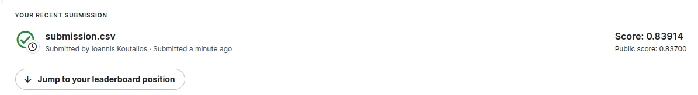

# g2net Hackathon in Thessaloniki

My attempt at the [g2net hackathon](https://www.kaggle.com/competitions/g2net-hackathon) in Thessaloniki.

## Results

|Dataset|Accuracy|
|:------:|:-------|
| Training | 87.53 % |  
| Validation | 82.35 % |
| Test | 83.91 % |

## Files
- `optimazation.py`: Contains the hyperparameter optimization using optuna.
- `network.py`: Contains the network used for the classification.
- `helper.py`: Contains helper functions for the network.
- `submission.py`: Contains the submission and evaluation function.

## Usage

Run the `optimization.py` file to find the best hyperparameters for the network. Then run the `network.py` file to train the network. Finally, run the `submission.py` file to create a submission file and evaluate the network.

## Information on the Hackathon

The data contain real noise segments of the Hanford detector during the O3 run, in which gravitational wave models were injected at different signal-to-noise ratios. The goal is to classify them into one of three categories:
- 0<=SNR<6 
- 6 <=SNR <10 
- SNR >= 10.

The injections correspond to binary black hole mergers with non-aligned spins, having masses between 7 and 50 times the solar mass, randomly distributed at different sky localizations and inclinations and in a distance ranges that results in signal to noise ratios up to about 50.

The full set of notebooks and tutorials can be found [here](https://github.com/niksterg/g2net_4th_training_school_thessaloniki_2023).   